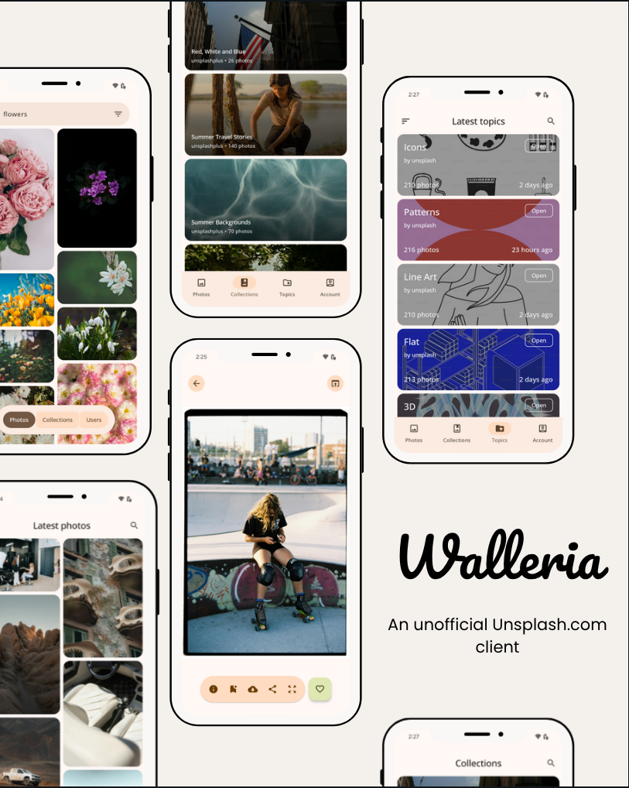

# Walleria


A simple and beautiful Material You photo client for Android powered by [Unsplash](https://unsplash.com). This is an **unofficial** application, exploring the feasibility of some conceptions is the goal of this project.

If you like this project or inspired by any ideas of this project, please star it without any hesitation. Also, feel free to suggest something or contribute 😊.
# About
The Internet's source of freely-usable images. Powered by creators everywhere.

* Browse Over 3 million free high-resolution images brought to you by the world's most generous community of photographers
* A community of 293,995 photographers
* Find everyday inspiration
* Share your vision of the world
* Get stunning wallpapers every day
* Save favourite works

# Build
To access the Unsplash API you should have at least:
* Developer account at: https://unsplash.com/developers
* Your Access Key and Secret Key

Add these lines to the project's `local.properties` file:
```
unsplash_access_key_debug = "<Debug Access Key>"
unsplash_secret_key_debug = "<Debug Secret Key>"
unsplash_access_key_release = "<Release Access Key>"
unsplash_secret_key_release = "<Release Secret Key>"
```

> **Note**  
> You can leave `unsplash_access_key_release` and `unsplash_secret_key_release` empty if you are not planning to compile in release mode.

# Technology stack
* Kotlin
* Jetpack Compose (with Material You)
* Coroutines
* Dagger Hilt
* Retrofit 2
* Paging 3
* Room
* DataStore
* Chrome custom tabs

# Special thanks
* [Albert Chang](https://github.com/mxalbert1996) and [Tlaster](https://github.com/Tlaster)
  for the [Zoomable composable component](https://github.com/mxalbert1996/Zoomable).

* [Tlaster](https://github.com/Tlaster) for the [NestedScrollView](https://github.com/Tlaster/NestedScrollView/) implementation idea for jetpack compose.

* [Musa Adanur](https://lottiefiles.com/musaadanur) for the [Astronaut](https://lottiefiles.com/animations/professional-icon-animation-pYejkhGHZu) animation.<br/>
* [John Corcoran](https://lottiefiles.com/lu2e4r2a03bxxac8) for the [Broken stick error](https://lottiefiles.com/animations/connect-icon-W2s7wnF5Sw) animation.<br/>
* [Junior Torres](https://lottiefiles.com/nwuiosky9p) for the list item [Loading](https://lottiefiles.com/animations/loading-Ymt2HaA2pc) animation.

# License
```
MIT License
Copyright (c) 2023 Andrii Andrushchenko
Copyright (c) 2022 Albert Chang
Copyright (c) 2021 Tlaster

Permission is hereby granted, free of charge, to any person obtaining a copy
of this software and associated documentation files (the "Software"), to deal
in the Software without restriction, including without limitation the rights
to use, copy, modify, merge, publish, distribute, sublicense, and/or sell
copies of the Software, and to permit persons to whom the Software is
furnished to do so, subject to the following conditions:

The above copyright notice and this permission notice shall be included in all
copies or substantial portions of the Software.

THE SOFTWARE IS PROVIDED "AS IS", WITHOUT WARRANTY OF ANY KIND, EXPRESS OR
IMPLIED, INCLUDING BUT NOT LIMITED TO THE WARRANTIES OF MERCHANTABILITY,
FITNESS FOR A PARTICULAR PURPOSE AND NONINFRINGEMENT. IN NO EVENT SHALL THE
AUTHORS OR COPYRIGHT HOLDERS BE LIABLE FOR ANY CLAIM, DAMAGES OR OTHER
LIABILITY, WHETHER IN AN ACTION OF CONTRACT, TORT OR OTHERWISE, ARISING FROM,
OUT OF OR IN CONNECTION WITH THE SOFTWARE OR THE USE OR OTHER DEALINGS IN THE
SOFTWARE.
```